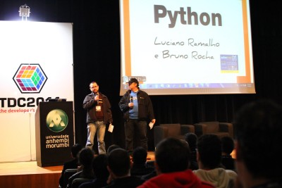
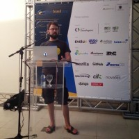
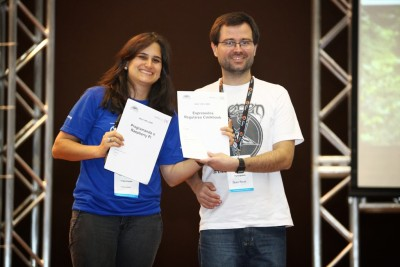
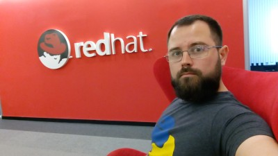
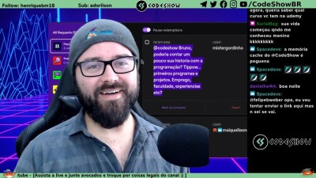
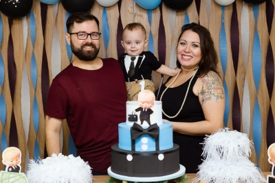
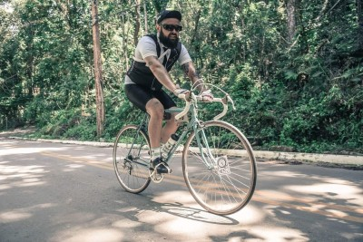

# Olá Mundo

Meu nome é **Bruno Rocha**. Eu venho trabalhando profissionalmente com computadores desde o ano **2000** e eu atualmente sou programador na [Red Hat](https://redhat.com).

No inicio da minha carreira eu tive a oportunidade de trabalhar com diversas linguagens e tecnologias entre elas _SQL, Perl, C, VB, PHP, C# e .NET_ e passei por algumas grandes empresas como **Coelba** e **Palm** Inc onde aprendi muito com profissionais excelentes.

 _year 2000_ working as a MS Access 97 developer.

Eu comecei a utilizar Linux em **1998** através da curiosidade somada a uma revista que trazia um CD-ROM do [Conectiva Linux](https://pt.wikipedia.org/wiki/Conectiva) e desde então me tornei um entusiasta do Open Source.

Conheci a linguagem Python através de uma distribuição Linux Brasileira chamada [Kurumim](https://pt.wikipedia.org/wiki/Kurumin) que utilizava Python para automatizar muitas tarefas e vinha com um excelente tutorial de Python embutido em um de seus menus do KDE.

Estudei Sistemas de Informação e contrariando todas as grades curriculares a minha graduação utilizou [Pascal](https://en.wikipedia.org/wiki/Pascal_(programming_language)) e Delphi ao invés dos tradicionais C e Java.

Minha linguagem de programação principal vem sendo [Python](https://python.org) desde 2007 e já tive a oportunidade de trabalhar em projetos de diversos tamanhos e escalas para diversas areas como Desenvolvimento Web, Automação de testes e processos e também sou mantenedor de [algumas bibliotecas de código aberto](https://pypi.org/user/rochacbruno/) utilizadas pela comunidade Python.

Em 2008 eu atuei como core developer de um conhecido [framework web](https://web2py.com/) e através dessas contribuições adquiri experiência em desenvolvimento web e manutenção de projetos open-source e então em 2012 eu co-publiquei um [livro a respeito](https://www.packtpub.com/web-development/web2py-application-development-cookbook). E neste mesmo ano fui nomeado membro da Python Software Foundation, uma organição onde atuo colaborando na manutenção do [site Python Planet](https://github.com/python/planet) e do Fellow Workgroup.

Desde 2010 venho me dedicando a compartilhar conhecimento com a comunidade de desenvolvimento de software, especialmente a conteúdo educacional através de video aulas e também dando palestras nas principais conferências e meetups da comunidade Python no Brasil e Portugal.

Em 2013 fui o ganhador do prêmio Dorneles Tremea, um reconhecimento da colaboração com a comunidade Python Brasileira emitido pela APyB, organização da qual já atuei como vice-presidente e ativo colaborador durante muitos anos.

Utilizando o framework Django ajudei a desenvolver alguns dos maiores portais de contéudo e notícias do Brasil e a desevolver um [CMS de alta escala](https://github.com/opps/opps).

Em 2014 passei a me dedicar ao estudo do framework web Flask e atuei como Data Engineer e desenvolvedor de APIs em um dos maiores job boards do mundo, desenvolvi APIs de larga escala voltadas a data science utilizando Flask e publiquei alguns artigos e extensões e desde então venho me dedicando a ensinar Flask e Desenvolvimento web.

Durante este periodo tive a oportunidade de criar os meus principais projetos open source, entre eles o [Quokka CMS](https://github.com/quokkaproject), o [Flasgger](https://github.com/flasgger) (extensão para criação de APis com openapi spec que está por trás do httpbin.org), várias extensões para o Flask e o meu principal projeto que mantenho ativamente chamado [Dynaconf](https://github.com/dynaconf), uma biblioteca para facilitar o gerenciamento de configurações em projetos Python.

Em 2016 entrei na [Red Hat](https://redhat.com) para trabalhar como Engenheiro de Qualidade levando minha experiência de desenvolvimento de frameworks e bibliotecas para os times de testes da Red Hat e contribuindo com a criação e manutenção de ferramentas e frameworks de testes e manutenção de ambientes de integração continua.

Em 2017 eu criei um canal no [Youtube](https://youtube.com/CodeShowBR) dedicado a ensinar Flask e Python e desde então venho compartilhando videos com dicas de programação.

Neste mesmo ano eu comecei a aprender a [Linguagem Rust](https://rust-lang.org) e a participar da comunidade Rust e me tornei um entusiasta da linguagem.

Em 2019 eu comecei a compartilhar meus aprendizados de Rust em forma de live coding na twitch, a experiência deu bastante certo que este se tornou um dos meus principais projetos (e praticamente um segundo emprego) desde então faço streams 3 vezes por semana no [CodeShow](https://twitch.tv/codeshow) um canal dedicado a Python e Rust, em 2020 me tornei parceiro verificado da Twitch, membro dos times [Live Coders](https://twitch.tv/teams/livecoders) e [Live Coders Brasil](https://twitch.tv/teams/livecodersbrasil) e tenho levado conteúdo educacional de programação de maneira livre e aberta.

Depois de 4  anos atuando na area de testes em 2020 eu voltei a atuar como desenvolvedor web no Projeto [Red Hat Ansible Galaxy](https://galaxy.ansible.com/), um portal de soluções Ansible desenvolvido em Python e Django.

Outras curiosidades sobre mim: 

Eu sou casado com a [KarlaMag](https://twitch.tv/KarlaMag), uma excelente fotógrafa que agora está também aprendendo a programar em Python e também está bastante envolvida com a comunidade de Live Coding e em 2018 fizemos o deploy do nosso principal projeto, o [Erik](https://instagram.com/erikices) :)

Sou vegetariano desde que nasci (nunca comi nada de carne) e desde 2003 eu sou vegano (não consumo nada de origem animal).

O único esporte que eu gosto é o ciclismo, sou apaixonado por ciclismo clássico e já participei de eventos de corrida de bicicleta vintage como Eroica e Eroica Punta Del Este.

Quando adolescente eu cantava em uma banda de Heavy Metal Progressivo e até hoje mantenho o gosto por todas as  vertentes do heavy metal, mas além disso eu também escuto bastante música brasileira e especialmente música brega.

Se eu não fosse programador eu provavelmente atuaria na area de alimentação, artesanal e feita bem devagar. Gosto de cozinhar comida vegana e também gosto muito de fazer pães.

Gosto muito de tatuagens e tenho mais de 30 em sua grande maioria animais como ratos, galos, sapos entre outros.

Eu não gosto de jogar video games, por mais que eu me interesse pela area de desenvolvimento de jogos é apenas pela programação envolvida, jogar é algo que não tenho o costume.

A coisa que mais gosto de fazer é aprender novas habilidades técnicas ou não, e então compartilhar o conhecimento adquirido com a comunidade :)
